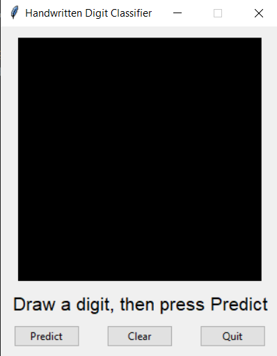

# Handwritten Digit Classifier

A handwritten digit recognition application built with **PyTorch**, **Torchvision**, and **Tkinter**.

The project trains a convolutional neural network to classify digits from `0` to `9`. It also includes a drawing interface for testing predictions and a data-collection application for adding personal handwriting samples.

## Demo

Draw a digit in the application and press **Predict** to see the model’s top three predictions.



## Project Overview

The project began as a simple neural network trained on the MNIST handwritten digit dataset.

Although the original model performed well on MNIST, it struggled with digits drawn using the application. Mouse-drawn digits can differ from MNIST in stroke thickness, size, position, and writing style.

To improve real-world performance, the project was expanded to include:

* A convolutional neural network
* Image augmentation
* A drawing interface
* A personal training-data collector
* Fine-tuning on user-created examples
* Personal validation data
* Confusion-matrix reporting

This allowed the model to adapt to handwriting produced through the same interface used for testing.

## Features

* Classifies handwritten digits from `0` to `9`
* Uses a convolutional neural network built with PyTorch
* Trains on the MNIST dataset
* Supports personal handwriting samples
* Fine-tunes an existing trained model
* Displays the top three predictions and confidence scores
* Includes a Tkinter drawing interface
* Includes a labeled training-data collection application
* Reports MNIST and personal validation accuracy
* Generates confusion matrices for analyzing mistakes
* Automatically saves the best-performing model

## Project Structure

```text
handwritten-digit-classifier/
├── model.py
├── train.py
├── draw.py
├── collect_digits.py
├── requirements.txt
├── README.md
├── .gitignore
├── screenshots/
├── personal_digits/
│   ├── 0/
│   ├── 1/
│   ├── 2/
│   ├── 3/
│   ├── 4/
│   ├── 5/
│   ├── 6/
│   ├── 7/
│   ├── 8/
│   └── 9/
└── personal_validation/
    ├── 0/
    ├── 1/
    ├── 2/
    ├── 3/
    ├── 4/
    ├── 5/
    ├── 6/
    ├── 7/
    ├── 8/
    └── 9/
```

## Model Architecture

The model is a convolutional neural network designed for grayscale `28 × 28` images.

```text
Input image: 1 × 28 × 28
        ↓
Convolution: 32 channels
Batch normalization
ReLU
Max pooling
        ↓
Convolution: 64 channels
Batch normalization
ReLU
Max pooling
        ↓
Convolution: 128 channels
Batch normalization
ReLU
        ↓
Fully connected layer
Dropout
        ↓
10 output logits
```

Convolutional layers help the network identify local features such as:

* Curves
* Loops
* Diagonal strokes
* Crossbars
* Corners
* Digit tails

These features are useful for distinguishing similar digits such as `2`, `4`, `7`, and `9`.

## Requirements

* Python 3.10 or newer
* PyTorch
* Torchvision
* NumPy
* Pillow
* Tkinter

Tkinter is included with many Python installations. Some Linux distributions require it to be installed separately.


## Requirements File

The `requirements.txt` file should contain:

```text
torch
torchvision
numpy
Pillow
```

## Usage

### 1. Collect personal handwriting samples

Run:

```bash
python collect_digits.py
```

Choose the correct digit label, draw the digit, and save it.

The images are stored in folders based on their labels:

```text
personal_digits/4/example.png
personal_digits/7/example.png
```

Keyboard shortcuts may also be available:

* Number keys select a label
* Enter saves the drawing
* Space clears the canvas

Collect examples for every digit, not only the digits the model currently misclassifies.

A useful starting point is:

```text
50–100 training examples per digit
10–20 validation examples per digit
```

The validation drawings should be different from the training drawings.

### 2. Train the model

Run:

```bash
python train.py
```

The training script:

1. Downloads MNIST if necessary
2. Loads personal training images
3. Applies image augmentation
4. Trains or fine-tunes the CNN
5. Measures MNIST accuracy
6. Measures personal validation accuracy when available
7. Saves the best model as `digit_model.pth`
8. Prints confusion matrices

If `digit_model.pth` already exists and matches the current model architecture, training continues from the saved weights using a smaller learning rate.

### 3. Test the model

After training finishes, run:

```bash
python draw.py
```

Draw a digit and press **Predict**.

The application displays the model’s top three predictions, for example:

```text
7: 91.4% | 2: 5.7% | 9: 1.8%
```

## Training Data

The project uses two main data sources.

### MNIST

MNIST contains grayscale images of handwritten digits. It provides a useful general starting point for training.

### Personal handwriting

Personal samples are created through the project’s data-collection interface.

These images are especially important because they match the drawing conditions used by the prediction application, including:

* Mouse or trackpad input
* Application brush thickness
* Application resizing
* Application centering
* Personal writing style

The training script repeats personal examples within the combined dataset so they are not overwhelmed by the much larger MNIST dataset.

## Image Preprocessing

Before prediction, each drawing is:

1. Cropped to remove empty space
2. Resized while preserving its aspect ratio
3. Placed inside a `28 × 28` grayscale image
4. Centered using its pixel center of mass
5. Converted to values between `0` and `1`
6. Normalized using MNIST statistics
7. Converted into a PyTorch tensor

The final tensor has the shape:

```text
1 × 1 × 28 × 28
```

This represents:

```text
batch size × channels × height × width
```

Training and prediction use matching preprocessing so that the model receives images in a consistent format.

## Data Augmentation

The training script applies small random transformations such as:

* Rotation
* Translation
* Scaling
* Shearing

These transformations help the model recognize digits despite small differences in position, slant, and size.

Personal images use less aggressive augmentation because they already closely resemble the target drawing interface.

## Evaluation

The project tracks two types of accuracy.

### MNIST accuracy

Measures how well the model performs on the standard MNIST test set.

### Personal validation accuracy

Measures how well the model performs on new personal drawings that were not used during training.

Personal validation accuracy is the more important measurement for the drawing application.

The script also generates confusion matrices.

Rows represent the correct digit, and columns represent the predicted digit.

For example:

```text
matrix[4, 9]
```

represents the number of actual `4`s that the model predicted as `9`s.

## Training Workflow

A typical workflow is:

```bash
python collect_digits.py
python train.py
python draw.py
```

When the model makes mistakes:

1. Collect more examples of the difficult writing style
2. Add them to the correct label folder
3. Run `train.py` again
4. Restart `draw.py`
5. Test the updated model

This creates a simple feedback loop in which the model gradually becomes better at recognizing the user’s handwriting.

## What I Learned

This project helped me learn how to:

* Build a convolutional neural network with PyTorch
* Train a model using mini-batch gradient descent
* Use loss functions and optimizers
* Save and load model weights
* Apply image preprocessing and normalization
* Use data augmentation
* Build a desktop interface with Tkinter
* Collect and organize labeled image data
* Fine-tune a model on custom data
* Evaluate performance with validation sets
* Interpret confusion matrices
* Diagnose domain mismatch between training and real-world inputs

One of the main lessons from the project was that high benchmark accuracy does not always mean a model will work well in a real application.

The original model performed well on MNIST but struggled with mouse-drawn digits. Training on examples collected through the application produced a much larger practical improvement than simply making the model deeper or training it for more epochs.

## Limitations

* The model only recognizes single digits
* Predictions depend on the quality of the collected personal data
* Softmax confidence does not guarantee that a prediction is correct
* Very unusual digit styles may still be misclassified
* The model expects a light digit on a dark background
* The application is designed for desktop use
* The model is specialized for `28 × 28` grayscale inputs

## Possible Improvements

Future improvements could include:

* Saving mistakes directly from the prediction interface
* Adding an undo button
* Displaying the processed `28 × 28` model input
* Plotting confidence scores as a bar chart
* Adding early stopping during training
* Creating training and validation graphs
* Supporting multiple users and handwriting profiles
* Exporting the model to ONNX
* Creating a browser-based version
* Recognizing multi-digit numbers
* Comparing the CNN with other model architectures

## License

This project is available under the MIT License.

## Acknowledgments

* PyTorch for the machine-learning framework
* Torchvision for MNIST and image transformations
* Pillow for image processing
* Tkinter for the desktop interface
* The creators of the MNIST handwritten digit dataset
